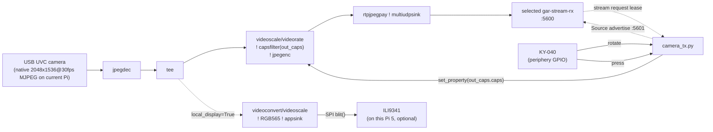

# gar-stream-tx — Raspberry Pi 5 + OV3660 USB カメラ（TX 側）

**目的:** [gar-stream-rx](https://github.com/ThousandsOfTies/gar-stream-rx)（Luckfox Lyra Plus のビデオ
モニター）へ MJPEG/RTP Sourceを提供するTX側。TXはRXのaddressを保持せず、
UDP discoveryで自己広告し、RXから送信要求が届いた間だけ要求元へ配信する。カメラは

> USBカメラモジュール OV3660搭載｜USB2.0出力・2048×1536／15fps・110°広角｜
> スマホ・タブレット対応OTG（Android/iOS）

を使う。KY-040 ロータリーエンコーダで、送信映像のオンスクリーンメニューを
操作する。これは実機・GARシミュレーションで共通の操作である。

- **押す** → メニューを表示 → サブメニューを開く → 値を決定
- **回す** → 項目、またはサブメニュー内の候補を選択

メニューは **Profile**（解像度、全Profileで15fps固定）、**Mirror**（左右反転）、
**Rotate**（0° / 90° / 180° / 270°）、**Overlay**（TXローカル表示の状態表示）で構成する。
メインメニューの末尾は **EXIT** のみとし、各サブメニューは現在値にカーソルを
置いた状態で開く。操作ヒントの文字列は画面に表示しない。

加えて、**TX 自身に ILI9341 を直結してローカルプレビューを出す**。カメラ入力を
RX に送るクリーンなプログラム映像とは別に、同じ変換済みフレームとローカル用Overlayを
TX 上の SPI パネルにも描画できる
— 詳しくは「アーキテクチャ」と「1. 配線」を参照。ディスプレイを繋がない
場合は `GAR_LOCAL_DISPLAY=0` を指定して無効化できる。

## アーキテクチャ

カメラはネイティブ最大モード（2048×1536 MJPEG）でキャプチャし、GStreamer の
`tee`で経路を分岐する。capture FPSはUVC descriptorに存在する値へ合わせる必要があり、
現在のRaspberry Pi実機では30fps、配信出力は`videorate`後の15fps固定である:

- **ネットワーク分岐**: `videoscale/videorate → capsfilter(out_caps) →
  jpegenc → rtpjpegpay → multiudpsink`。RXのlease付き要求を受けた宛先だけを
  `multiudpsink`のclientとして追加する。
- **ローカルプレビュー分岐**（`local_display=True` のときだけ追加）:
  `videoconvert/videoscale → RGB565 → appsink` で Python 側が受け取り、
  ILI9341 に SPI で blit する（gar-stream-rx の `video_monitor.py` と同じ
  appsink → blit の作り）。



GStreamer は **PyGObject** 経由でプロセス内に常駐させ（`gst-launch-1.0` を
サブプロセスとして起動し直す方式ではない）、KY-040 でサイズ/レートを変えても
`out_caps` という名前の `capsfilter` の `caps` プロパティを差し替えるだけで、
ダウンストリーム（videoscale/videorate/jpegenc/rtpjpegpay/multiudpsink）がライブに
再ネゴシエーションする。カメラのキャプチャ自体（`v4l2src`）は常にネイティブ
モードのままで一切再オープンしないので、パイプライン全体の再起動・RX 側の
瞬断は発生しない。

任意の SIZE プリセットがカメラの UVC ディスクリプタに実在する discrete
モードとは限らないため（未確認）、ネットワーク分岐は常にソフトウェアで
デコード→リサイズ→フレーム間引き→再エンコードする構成にして、
`v4l2-ctl --list-formats-ext` を確認していなくても確実に動く方を優先した。
実際のモード一覧を確認できて、目的のサイズ/レートが native mode として
存在するとわかれば、[gar-stream-rx/README.md](https://github.com/ThousandsOfTies/gar-stream-rx/blob/main/README.md)
の直接 `rtpjpegpay` パイプライン（デコード/エンコード無し）に固定した方が
CPU 負荷は下がる。

### Source discoveryと送信要求

control planeは`gar-stream/1` JSON messageをUDP 5601で交換する。TXは
`source_announce`を定期送信し、RXの`source_query`にもunicast応答する。RXがSourceを
確定すると`stream_request`を送り、TXはpacketの送信元IPと要求内のRTP portを
`multiudpsink`へ追加する。要求はlease方式で、RXが更新を止めるか`stream_stop`を
送るとTXは宛先を削除する。第三者IPを要求に埋め込めないため、UDP reflectionの宛先には
利用できない。

同一LANではbroadcastだけで設定不要。broadcastが届かないnetworkではRX側の
`GAR_STREAM_DISCOVERY_PEERS`からTXへ`source_query`を送る。TX側にはRX addressの
固定設定もnetwork別の分岐も持たせない。

## 1. 配線

Raspberry Pi 5 の BCM GPIO 番号をそのまま使う（Luckfox と違い `luckfox-config`
のようなピンマルチプレクサは不要）。デフォルトは:

| KY-040 | GPIO (BCM) |
|---|---|
| CLK | GPIO17 |
| DT  | GPIO27 |
| SW  | GPIO22 |
| +   | 3.3V |
| GND | GND |

配線が違う場合は `camera_tx.py` の `CONFIG` を書き換える。KY-040 ボードは
`CLK`/`DT`/`SW` にプルアップが無いことが多いので、読み取りがガタつく場合は
3.3V に 10kΩ でプルアップする（[gar-stream-rx/README.md](https://github.com/ThousandsOfTies/gar-stream-rx/blob/main/README.md)
の同じ注記を参照）。

カメラは USB2.0 ポートへ直結する（本製品は Android/iOS 向け OTG 対応だが、
Pi 5 では通常の USB UVC カメラとして `/dev/video0` に見える）。

### オプション: ローカルプレビュー用 ILI9341

`CONFIG["local_display"] = True` にする場合は、[gar-stream-rx/README.md](https://github.com/ThousandsOfTies/gar-stream-rx/blob/main/README.md)
の「1. 配線」と同じ要領で ILI9341 を Pi 5 の SPI0 に配線する
（`VCC`→3.3V, `GND`→GND, `CS`→SPI0 CE0, `RESET`→任意の GPIO, `DC`→任意の
GPIO, `SDI(MOSI)`→SPI0 MOSI, `SCK`→SPI0 SCLK, `LED`→3.3V）。Raspberry Pi は
`raspi-config` で SPI を有効化するだけで済み、Luckfox のようなピン
マルチプレクサ設定は不要。DC/RESET は空いている GPIO を好きに選び、
`CONFIG["dc_gpio"]`/`CONFIG["rst_gpio"]` に書く。

## 2. 実機設定

通常のGAR実機deployでは設定なしで起動できる。hostnameからSource ID/表示名を作り、
UDP 5601で自己広告する。`/etc/gar/gar-stream-tx.env`はカメラ、LCD、Source表示名を
defaultから変える場合だけ使用する任意設定である。Raspberry Pi 5では実機entry pointが
`GAR_GPIO_CHIP=/dev/gpiochip0`を設定し、BCM番号を同chipのline番号として開く。
また、接続中のUVCカメラが広告する2048x1536 MJPEG capture modeに合わせて30fpsを
既定とするが、`videorate`後の配信は15fps固定である。TXにRXのIP設定は存在しない。

```python
CONFIG = {
    "enc_clk_gpio": 17,
    "enc_dt_gpio": 27,
    "enc_sw_gpio": 22,
    "camera_device": "/dev/video0",
    "native_width": 2048,
    "native_height": 1536,
    "native_fps": 30,
    "source_id": "<hostname>-tx",
    "source_name": "<hostname>",
    "discovery_port": 5601,
    "jpeg_quality": 85,

    # TX に直結した ILI9341 でローカルプレビューを出す場合は True にして
    # dc_gpio/rst_gpio も埋める（配線は README「1. 配線」参照）。
    "local_display": False,
    "spi_bus": 0,
    "spi_device": 0,
    "spi_max_hz": 24_000_000,
    "dc_gpio": None,
    "rst_gpio": None,
}
```

## 3. Profile とオンスクリーンメニュー

```python
PROFILES = (
    ("Low latency", 320, 240),
    ("Standard", 640, 480),
    ("High quality", 1024, 768),
    ("Maximum", 2048, 1536),
)
FIXED_FPS = 15
```

いずれも 4:3 に揃えている。RX 側の ILI9341 パネルが 320×240（4:3）なので、
レターボックス無しで表示できる。既定値の Standard（640×480）はパネル解像度
のちょうど2倍で、SPI 帯域にも余裕がある。映像転送の安定性を保つためFPSは
15fps固定であり、Profileを変えてもFPSは変化しない。

メニューを開いている間は、OverlayがOFFでもTXローカル表示には操作内容が表示される。
決定して閉じた後はOverlay設定がそのまま反映される。MirrorとRotateは送信側
で適用されるため、RXの表示およびネットワーク上のクリーンな映像に同じ結果が届く。
メニュー・状態表示は送信映像には焼き込まれない。

## 4. GARからRaspberry Pi 5へdeploy

product workspace側でTargetに`raspberry-pi-5`、実機環境に`ssh_scp`を設定する。

```bash
gar target prepare --workspace Local/GarStreamTx  # 初回・recipe更新時
gar target build --workspace Local/GarStreamTx
gar target deploy --workspace Local/GarStreamTx
```

`prepare`はRaspberry Pi OSへGStreamer/Python runtime、非rootの`gar`account、
device group、限定sudo installer、共通`gar-app@.service`を導入する。product artifactは
このsourceと`/opt/gar/apps/gar-stream-tx/run`だけを配置し、simulation stubや独自の
root service unitを実機へ送らない。

deploy後は共通serviceから直ちに起動してSource広告を開始する。任意設定が必要なら
artifact同梱exampleから永続envを作る。通常の再deployとTarget recipe再適用では
このfileとSSH鍵を上書きしない。

```bash
ssh raspi5
sudo install -D -m 0644 \
  /opt/gar/apps/gar-stream-tx/gar-stream-tx.env.example \
  /etc/gar/gar-stream-tx.env
sudo editor /etc/gar/gar-stream-tx.env
sudo systemctl restart gar-app@gar-stream-tx.service
systemctl status gar-app@gar-stream-tx.service --no-pager
```

## 5. Source checkoutから直接診断する

GARを介さずsource checkoutから診断する場合だけ、Raspberry Pi OSへ依存packageを
手動導入して実行する。通常deployでは前節のTarget recipeが同じpackageを準備する。

```bash
sudo apt install python3-gi python3-spidev python3-periphery \
  gir1.2-gstreamer-1.0 gir1.2-gst-plugins-base-1.0 \
  gstreamer1.0-tools gstreamer1.0-plugins-good gstreamer1.0-plugins-bad v4l-utils
python3 camera_tx.py
```

起動ログに現在のProfile、Source ID、discovery portが出る。RXから要求されると
`receiver-id@host:port`がclient一覧へ追加される。KY-040を押して
メニューを開き、回して項目を選んでから押すと編集に入る。もう一度押すと値を
確定してメニューを閉じる。Profileの変更はネットワーク分岐の`capsfilter`を
ライブ更新するため、カメラ入力を再オープンしない（数フレーム分の乱れはあり得る）。

`Ctrl-C` で GStreamer パイプラインと KY-040 のスレッドを両方止める。

## トラブルシューティング

- **`ModuleNotFoundError: No module named 'gi'`**: PyGObject はシステム
  パッケージ（`sudo apt install python3-gi`）で入れる。pip の `PyGObject`
  はビルドが面倒で非推奨（gar-stream-rx の README と同じ注意）。
- **`gst-launch-1.0`/GStreamer 系コマンドが無い**: `sudo apt install
  gstreamer1.0-tools gstreamer1.0-plugins-good gstreamer1.0-plugins-bad`
  （jpegenc/jpegdec/rtpjpegpay は plugins-good、環境によっては
  plugins-bad 側にあることも）。
- **`/dev/video0` が無い / Permission denied**: `ls -l /dev/video*` で確認し、
  ユーザーを `video` グループに入れる（`sudo usermod -aG video $USER` 後に
  再ログイン）。
- **起動直後にすぐ終了する**: カメラが設定中のwidth/height/FPSでMJPEGを
  出しているか `v4l2-ctl --list-formats-ext -d /dev/video0` で確認する。現在の
  Raspberry Pi実機では`2048x1536@30fps`である。
  ネイティブモードがこれと違う場合は `CONFIG["native_width"/"native_height"/
  "native_fps"]` を実際の値に合わせる。
- **KY-040 を回してもサイズが変わらない**: 配線/GPIO 番号を確認
  （[gar-stream-rx/README.md](https://github.com/ThousandsOfTies/gar-stream-rx/blob/main/README.md) と同じ症状・対策）。
- **RXのSource一覧に出ない**: 同一LANでUDP 5601が通るか確認する。ルーターや
  cloud networkを越える場合はRX側だけに`GAR_STREAM_DISCOVERY_PEERS=<TX address>`を
  設定する。
- **選択できるが映像が来ない**: RXからTXへのUDP 5601と、TXから要求元RXへの
  RTP/UDP 5600が通るか確認する。TXログのreceiver一覧にRXが追加されるかも確認する。
- **ローカルプレビューが真っ暗/映らない**: `local_display=True` にした際に
  `dc_gpio`/`rst_gpio` を埋め忘れていないか、配線が
  [gar-stream-rx/README.md](https://github.com/ThousandsOfTies/gar-stream-rx/blob/main/README.md) と同じ極性/結線に
  なっているか確認する（ILI9341 側のトラブルシューティングもそちらを参照）。

## EC2 でのシミュレーション

[gar-stream-rx](https://github.com/ThousandsOfTies/gar-stream-rx) と同様、こちらも本物のボードが
無くても `gar-tools` の linux-device ランタイム（EC2 Graviton 上で `/dev/*`
互換を提供する仕組み）で大部分を検証できる。

- **KY-040（GPIO）**: gar-stream-rx 用に追加した
  [gar-tools/targets/linux-device/runtime/web-bridge](https://github.com/ThousandsOfTies/gar-tools/tree/main/targets/linux-device/runtime/web-bridge)
  の rotary シミュレーション（`ROTARY_CLK_LINE`/`ROTARY_DT_LINE`/
  `ROTARY_SW_LINE` の gpio-sim 制御、Virtual Hardware Panel の「◀ ● ▶」
  ダイヤル）がそのまま使える。gar-stream-tx と gar-stream-rx は別々の EC2
  インスタンス（別ターゲット）で動かす想定なので、同じ line 番号を使っても
  衝突しない。
- **カメラ（`/dev/video0`）**: 本物の UVC カメラの CUSE シミュレーションは
  ここでは実装していない。V4L2 の CUSE 化は `gar-tools/targets/luckfox-rv1106/
  docs/03_CAMERA_CUSE_ROADMAP.md` に別途ロードマップがある大きめのタスクで、
  このプロジェクト単体で先取り実装するのは過剰。代わりに、同じくロードマップ
  で「transitional fallback」と位置づけられている **`v4l2loopback`** を使う:

  ```bash
  sudo modprobe v4l2loopback video_nr=0 card_label="OV3660 sim" exclusive_caps=1
  # 別プロセスでダミー映像を /dev/video0 に流し込む（テストパターン）
  gst-launch-1.0 -v videotestsrc pattern=smpte is-live=true \
    ! video/x-raw,width=2048,height=1536,framerate=15/1 \
    ! videoconvert ! jpegenc ! v4l2sink device=/dev/video0
  ```

  こうすると `camera_tx.py` 自体は一切変更せずに（`/dev/video0` を開いて
  `image/jpeg,width=2048,height=1536,framerate=15/1` を要求するだけ）、KY-040
  によるサイズ/レート切り替えと `out_caps` のライブ差し替えロジックを EC2 上で
  検証できる。実際のカメラ固有の ISP/UVC ディスクリプタ挙動までは検証できない
  点に注意（それは実機 Pi 5 + 実カメラでの確認が必要）。
- **ローカルプレビュー（`local_display=True`）を EC2 で検証する場合**:
  gar-stream-rx 用に追加した
  [gar-tools/targets/linux-device/runtime/ili9341-stub](https://github.com/ThousandsOfTies/gar-tools/tree/main/targets/linux-device/runtime/ili9341-stub)
  の CUSE SPI スタブ（`/dev/spidev0.0` + DC ピン問い合わせ + フレームバッファを
  Virtual Hardware Panel に表示）がそのまま使える。ILI9341 のコマンド/データ
  プロトコルは gar-stream-rx と共通なので、追加のシミュレータ実装は不要。
